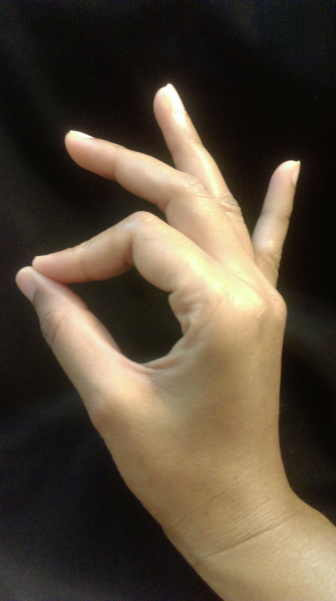

# Kathak Odyssey
## Kathak Ebook
Kathak is an north indian classical dance. This is the first ebook on Kathak, an attempt to create a digital presence on Kathak education. This journey started off as an Kathak educatino blog - [Kathak Odyssey](http://www.kathakodyssey.blogspot.com/) and led to write the first ebook on Kathak which is a work in progress. 

### In this ebook you will find five types of taals in Kathak, their definitions and notations:

1.  Teen Taal
2.  Jhap Taal
3.  Ek Taal
4.  Dadra
5.  Keherva

## Mudra Emojis: 

Hansasya :ok_hand:
Ardha Chandra :hand:
Suchi :point_right: 
Mushti :fist:
Shikhar :thumbsup:

### This ebook is intended to provide all basic Kathak education including types of tukdas, pranam(salutation) and more. Following is the check list :

- [x] Kathak certification levels
- [ ] Kathak Mudras
- [x] Teen Taal Definition
- [x] Teen Taal Notation
- [x] Teen Taal youtube link
- [x] Jhap Taal Definition
- [x] Jhap Taal Notation
- [x] Jhap Taal youtube link
- [x] Ek Taal Definition
- [x] Ek Taal Notation
- [x] Ek Taal youtube link
- [x] Dadra Taal Definition
- [x] Dadra Taal Notation
- [x] Dadra Taal youtube link
- [x] Keherva Taal Definition
- [x] Keherva Taal Notation
- [x] Keherva Taal youtube link
- [ ] Tukda Definition
- [ ] Teen Taal Tukda
- [ ] Teen Taal Tukda youtube link
- [ ] Jhap Taal Tukda
- [ ] Jhap Taal Tukda youtube link
- [ ] Ek Taal Tukda
- [ ] Ek Taal Tukda youtube link
- [ ] Tihai Definition

